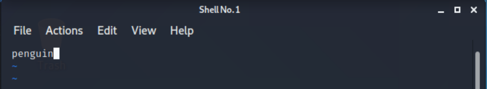
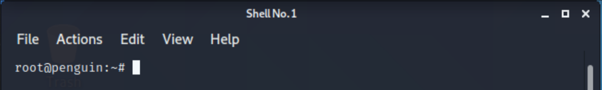

# Usernames and Passwords

## Changing the Username

## Changing the Password
#### Resetting a Forgotten Password on Kali VM

##### References:
- https://www.geekrar.com/how-to-reset-forgotten-password-of-kali-linux/
- https://askubuntu.com/questions/57620/getting-an-authentication-token-manipulation-error-when-trying-to-change-my-us

###### Steps:
1. Turn on Machine and when the `GNU GRUB` screen appears, press `E` on your keyboard

2. In the new screen navigate to the `linux` line and change the `ro` to `rw`. Additionally, add `init=bin\bash` to the end of the line.

3. Press `F10` to restart the machine. When the machine reboots, you should be brought to a black screen. On this screen type: `passwd root` and hit enter. Then type in your new password.

  Note: if this doesn't work, enter these two commands `mount -o remount,rw /` and `chmod 640 /etc/shadow` before entering `passwd root` again.

4. Reset the machine. You can do this by shutting the machine down and playing it again

5. Progress as normal

## Changing the Hostname

### References:
- https://www.blackmoreops.com/2013/12/12/change-hostname-kali-linux/

### Steps:
1. In the terminal enter `vim /etc/hostname`

  

2. Press `i` on the keyboard to change to `insert` mode (so you can change the text)

3. Delete `kali` (or whatever is in the file) and replace with your desired desktop name

  

4.  To exit press `ECS` key, then the following keys in succession `:wq!`. Then press `enter`

  

5. To see the changes `reboot` (restart)

  
  
